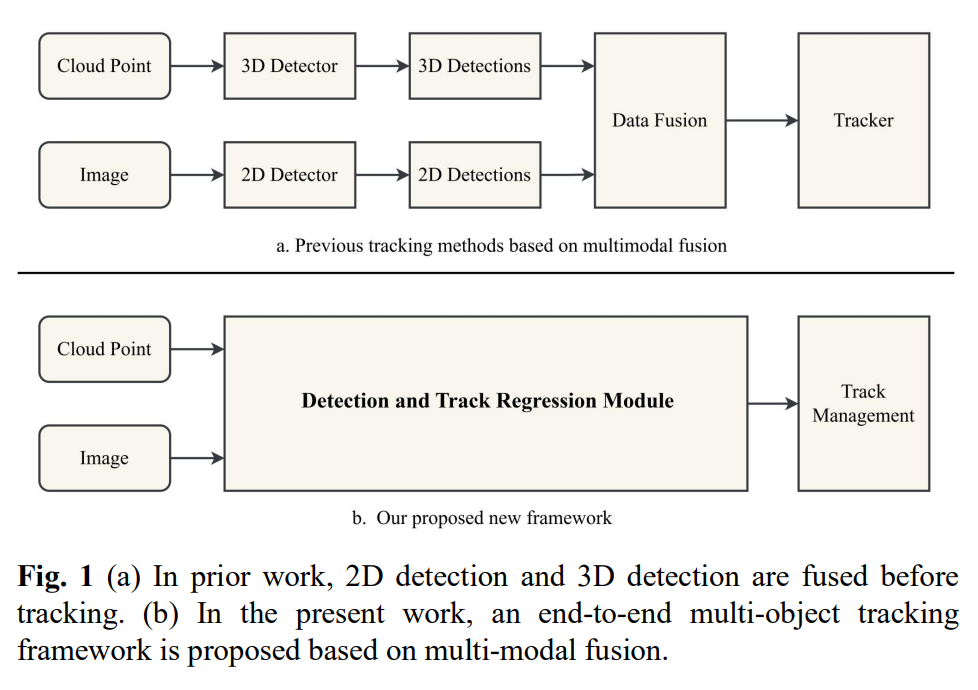

[](https://badges.toozhao.com/stats/01GY94BEY4RQCFS93XZSXWBWS1 "Get your own page views count badge on badges.toozhao.com")

#  You Only Need Two Detectors to Achieve Multi-Modal 3DMulti-Object Tracking  

This is the offical implementation of paper "[You Only Need Two Detectors to Achieve Multi-Modal 3D Multi-Object Tracking](https://arxiv.org/abs/2304.08709) "



Firstly, this paper proposes a new multi-object tracking framework based on multi-modal fusion. By integrating object detection and multi-object tracking into the same model, this framework avoids the complex data association process in the classical TBD paradigm, and our proposed method does not require additional training. Secondly, by exploring the confidence of historical trajectory regression, we analyze the possible states of the trajectory in the current frame (weak target or strong target) and design a fusion confidence module to guide the non-maximum suppression of trajectory and detection for ordered association. Finally, we conducted extensive experiments on the KITTI and WAYMO datasets. Our proposed method can achieve robust tracking using only two modal detectors and has higher accuracy than many of the latest multi-modal tracking methods based on the TBD paradigm.


## Overview
- [Update log](#jump)
- [Framework](#Framework)
- [Model Zoo](#jump2)
- [Getting Started](#jump3)
- [Acknowledgementn](#Acknowledgementn)
- [Citation](#Citation)

## <span id="jump">Update Log</span>

* 2023/4/3 Initial update
* 2023/4/19 Publication of paper and code

## <span id="Framework">Framework</span>

The multi-modal fusion-based multi-object tracking method proposed in this paper is structured as shown in Fig. 2. The structure consists of three modules: data input module, detection and trajectory regression module, and trajectory management module. The detection and trajectory regression module includes 2D/3D detectors, state prediction, and fusion confidence mechanism.


## <span id="jump2">Model Zoo</span>

### KITTI Dataset

* The results are obtained by combining different 3D detectors with 2D detector Faster-RCNN for the Car category on the KITTI val set.

* Currently, this repo supports most of the two -stage 3D detectors, such as [TED](https://github.com/hailanyi/TED), [CasA](https://github.com/hailanyi/CasA), [PV-RCNN](https://github.com/open-mmlab/OpenPCDet), [Voxel-RCNN](https://github.com/open-mmlab/OpenPCDet),  [PV-RCNN++](https://github.com/open-mmlab/OpenPCDet), etc.

|      Detectors       | HOTA(Car) | MOTA(Car) | IDs(Car) | weights                                                      |
| :------------------: | :-------: | :-------: | :------: | ------------------------------------------------------------ |
|         CasA         |   76.37   |   80.40   |  89.42   | [google](https://drive.google.com/file/d/1g1LcHCggUarBzEGxSR6b3cxJJsa7BTRg/view?usp=share_lin) / [baiduyun(6666)](https://pan.baidu.com/s/1FsE-ZuRea_tQdKwxL6ap9Q) |
| OpenPCDet/Voxel-RCNN |   77.52   |   82.11   |  90.75   | [google](https://drive.google.com/file/d/1EXN9vDlNuaoQi63M5PnosrYomqnxwdDz/view?usp=share_link) / [baiduyun(6666)](https://pan.baidu.com/s/1QxL_K1zUJAaHyxVsWGdBjw) |
|  OpenPCDet/PV-RCNN   |   75.88   |   76.11   |  88.58   | [google](https://drive.google.com/file/d/1EXN9vDlNuaoQi63M5PnosrYomqnxwdDz/view?usp=share_link) / [baiduyun(6666)](https://pan.baidu.com/s/1lGYGy4_1ReUoxUkAzr8rQg) |
| OpenPCDet/Point-RCNN |   54.25   |   48.34   |  66.22   | [google](https://drive.google.com/file/d/1Dpz0PMWWQOESabqyyEhN7S_jCQSqcK_K/view?usp=share_link) / [baiduyun(6666)](https://pan.baidu.com/s/1_MWx4YvX8edoJ-SskyL5LA) |
|     Faster RCNN      |   ----    |   ----    |   ---    | [google](/https://drive.google.com/file/d/1b2f9HKK_dbPIDcoJfW4XmKVIcSgvI6Js/view?usp=share_link) / [baiduyun(6666)](https://pan.baidu.com/s/1KGby_npWfRj9SMzxGmVhAw) |

### Waymo Dataset

|            Detectors            | Set  | Vehicle_L2 | Pedestrian_L2 | Cyclist_L2 |
| :-----------------------------: | :--: | :--------: | :-----------: | :--------: |
| OpenPCDet/PV-RCNN + Faster RCNN | val  |   53.02    |     47.45     |   40.45    |
| OpenPCDet/PV-RCNN + Faster RCNN | test |   60.48    |     50.08     |   56.55    |

We could not provide the above pretrained models due to [Waymo Dataset License Agreement](https://waymo.com/open/terms/), but you could easily achieve similar performance by training with the default configs of the detector(such as: casa, pcdet).

## <span id="jump3">Getting Started</span>

### Dependency

- Ubuntu 20.04
- NVIDIA CUDA 11.3
- Python 3.9.16
- PyTorch 1.8.1
- Spconv 2.3.3  #  pip install spconv-cu113
- 2x RTX4090 GPUs

### Prepare dataset

Tips: It is recommended to separate the "data" files from the YONTD-MOT source code files, so as to avoid lagging when opening PyCharm.

#### KITTI Dataset

To run this code, you should organize kitti tracking dataset as below:

```
# Kitti Tracking Dataset 

├── data
│   ├── kitti
│   │   │── tracking
│   │   │   │──testing
|   │   │   │   ├──calib
|   │   │   │   |    ├──0000.txt
|   │   │   │   |    ├──....txt
|   │   │   │   |    └──0028.txt
|   │   │   │   ├──image_02
|   │   │   │   |    ├──0000
|   │   │   │   |    ├──....
|   │   │   │   |    └──0028
|   │   │   │   ├──oxts
|   │   │   │   |    ├──0000.txt
|   │   │   │   |    ├──....
|   │   │   │   |    └──0028.txt
|   │   │   │   ├──label_02
|   │   │   │   |    ├──0000.txt
|   │   │   │   |    ├──....txt
|   │   │   │   |    └──0028.txt
|   │   │   │   ├──velodyne
|   │   │   │   |    ├──0000
|   │   │   │   |    ├──....
|   │   │   │   |    └──0028  
│   │   │   │──training  # the structure is same as testing set
|   │   │   │   ├──calib
|   │   │   │   ├──image_02
|   │   │   │   ├──pose
|   │   │   │   ├──label_02
|   │   │   │   └──velodyne 

```

#### Waymo Dataset

**Step 1**, after downloading the data from the [Waymo](https://waymo.com/intl/en_us/open/download/) official website and extracting it, it should be in the following format.

```
├── data
│   ├── waymo
│   │   │── testing
│   │   │   │── segment-xxxxxxxx.tfrecord
│   │   │   │── ...
│   │   │   │── There are a total of 150 files.
│   │   │── training
│   │   │   │── segment-xxxxxxxx.tfrecord
│   │   │   │── ...
│   │   │   │── There are a total of 798 files.
│   │   │── validation
│   │   │   │── segment-xxxxxxxx.tfrecord
│   │   │   │── ...
│   │   │   │── There are a total of 202 files.
```

**Step 2**, create a folder named `raw_data`, and then move all `segment-xxxxxxxx.tfrecord` files under the "testing," "training," and "validation" folders to the `raw_data` folder. Then, your file directory should look like the following.

```
├── data
│   ├── waymo
│   │   │── testing
│   │   │── training
│   │   │── validation
│   │   │── raw_data
│   │   │   │── segment-xxxxxxxx.tfrecord
│   │   │   │── ...
│   │   │   │── There are a total of 1150 files(include testing, training and validation).
```

**Step 3**, Run following command to creat dataset infos:

```
python3 -m dataset_utils.waymo.waymo_dataset 
```

**Finally,** your file directory will become as follows. You need to download the ImageSets file from [google](https://drive.google.com/drive/folders/1xanM-5nXgxSvTxNoIFYhrq_mHY8JwVAc?usp=share_link) or [baiduyun(6666)](https://pan.baidu.com/s/1lODHmWvIhY1He-l5iaYD8g).  

```
├── data
│   ├── waymo
│   │   │── testing
│   │   │── training
│   │   │── validation
│   │   │── ImageSets
│   │   │── raw_data
│   │   │   │── segment-xxxxxxxx.tfrecord
|   |   |   |── ...
|   |   |── waymo_processed_data_train_val_test
│   │   │   │── segment-xxxxxxxx/
│   │   │   │   │── FRONT
│   │   │   │      │── 0000.jpg
│   │   │   │      │── ...
│   │   │   │   │── FRONT_LEFT
│   │   │   │   │── FRONT_RIGHT
│   │   │   │   │── SIDE_LEFT
│   │   │   │   │── SIDE_RIGHT
│   │   │   │   │── 0000.npy
│   │   │   │   │── ...
|   |   |   |── ...
│   │   │   │── There are a total of 1150 files(include testing, training and validation).
│   │   │── pcdet_waymo_track_dbinfos_train_cp.pkl
│   │   │── waymo_infos_test.pkl
│   │   │── waymo_infos_train.pkl
│   │   │── waymo_infos_val.pkl

```

### Installation

```
git clone https://github.com/hailanyi/CasA.git
cd YONTDMOT
pip install -r requirements.txt

# If you Install corresponding dependencies based on different detectors.
# If you want to use the detector of OpenPCDet, please run following command:
cd detector/pcdet
python3 setup.py develop

# If you want to use the detector of CasA, please run following command:
cd detector/CasA
python3 setup.py develop

# If you want to use the detector of TED, please run following command:
cd detector/TED
python3 setup.py develop
```


### Quick start

#### KITTI Dataset

- Please modify the dataset path(`data_path`)  in the `config/kitti.yaml ` file to your own path.
- Then run ` python3 kitti_main.py`   
- The results are automatically saved to `output/training/`, and evaluated by HOTA metrics.

#### Waymo Dataset

- Please modify the dataset path(`DATA_PATH`)  in the `config/waymo.yaml ` file to your own path.
- Then run ` python3 waymo_main.py`    
- The results are automatically saved to `output/result_dets.pkl`.


## <span id="Acknowledgementn">Acknowledgementn</span>

This repo is developed from  [OpenPCDet](https://github.com/open-mmlab/OpenPCDet) and [CasA](https://github.com/hailanyi/CasA). A portion code is borrowed from [CasTrack-waymo](https://github.com/hailanyi/CasTrack-waymo). Many thanks to their wonderful work!


## <span id="Citation">Citation</span>

If you find this work useful, please consider to cite our paper:

```


```

